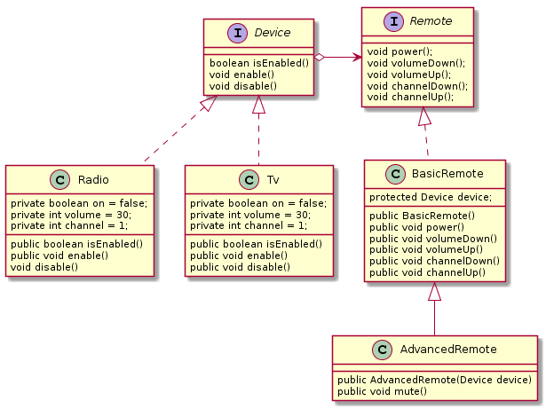

# Bridge pattern

## Cel

 Pozwala rozdzielić jedną dużą klasę na zestaw blisko związanych ze sobą klas w 2 oddzielnych hierarchiach (abstrakcji i implementacji ), które mogą być rozwijane osobno.

## Problem

Mam klasę Shape z parą podklas Cirle i Square, chcę aby te klasy włączyły w siebie kolory. Planuję stworzyć Red i Blue podklasy Shape.  

## Rozwiązanie

Aby rozwiązać ten problem przechodzimy z **dziedziczenia** na **kompozycję obiektu**. Oznacza to że oryginalny obiekt posiada referencję do osobnej hierarchii klasy.
### Abstrakcja i implementacja

*Abstrakcja* (zwana również interface’em) jest warstwą wysokiego poziomu kontroli encji. Ten poziom nie ma za zadanie wykonywać żadnej realnej pracy, powinien przekazywać tą pracę do warstwy implementacji (zwanej platformą).

## Struktura
1.  **Abstraction** wprowadza kontrolę logiki wysokiego poziomu. Opiera się na implementacji obiekcie aby wykonać aktualną pracę niskiego poziomu.

2. **Implementation** deklaruję wspólny dla wszystkich konkretnych implementacji  interface. Abstrakcja może się komunikować z implementacją obiektu za pomocą metod, które są zadeklarowane tutaj. Abstrakcja może listować te same metody co implementacja, ale zazwyczaj abstrakcja deklaruje bardziej złożone zachowanie, które opierają się na szerszej gamie prymitywnych operacji zadeklarowanych przez implementację.

3. **Concrete Implementations** zawiera kod specyficzny dla platformy.
4. **Refined Abstractions** wprowadza warianty kontroli logiki. Tak jak jej rodzic, pracują z różnymi implementacjami za pomocą ogólnej implementacji interface’u.

## Pseudocode



## Możliwość zastosowania

###### *Użyj wzorca mostu, jeśli chcesz podzielić i zorganizować klasę monolityczną, która ma kilka wariantów niektórych funkcji (na przykład, jeśli klasa może współpracować z różnymi serwerami bazy danych).*
- Im większa staje się klasa, tym trudniej jest dowiedzieć się, jak to działa, i tym dłużej trwa zmiana. Zmiany wprowadzone w jednym z wariantów funkcjonalności mogą wymagać wprowadzenia zmian w całej klasie, co często powoduje błędy lub nie zajmuje się niektórymi krytycznymi skutkami ubocznymi.

- Wzorzec mostu pozwala podzielić klasę monolityczną na kilka hierarchii klas. Następnie możesz zmienić klasy w każdej hierarchii niezależnie od klas w innych. Takie podejście upraszcza obsługę kodu i minimalizuje ryzyko uszkodzenia istniejącego kodu.

###### *Użyj wzorca, gdy chcesz rozszerzyć klasę na kilka ortogonalnych (niezależnych) wymiarów.*

- Most sugeruje wydzielenie osobnej hierarchii klas dla każdego z wymiarów. Oryginalna klasa deleguje powiązaną pracę do obiektów należących do tych hierarchii, zamiast robić wszystko samodzielnie.

###### *Użyj mostu, jeśli chcesz mieć możliwość przełączania implementacji w czasie wykonywania.*
- Chociaż jest to opcjonalne, wzorzec mostu pozwala zastąpić obiekt implementacji wewnątrz abstrakcji. To tak proste, jak przypisanie nowej wartości do pola.
- Nawiasem mówiąc, ten ostatni przedmiot jest głównym powodem, dla którego tak wiele osób myli Most z modelem Strategii. Pamiętaj, że wzorzec jest czymś więcej niż tylko pewnym sposobem na uporządkowanie twoich klas. Może również komunikować zamiary i rozwiązywać problemy.

## Przykład

``` java
public interface Device {
	boolean isEnabled();
	void enable();
	void disable();
	int getVolume();
	void setVolume(int percent);
	int getChannel();
	void setChannel(int channel);
	void printStatus();
}
```
``` java
public class Radio implements Device {
	private boolean on = false;
	private int volume = 30;
	private int channel = 1;

	@Override
	public boolean isEnabled() {return on;}

	@Override
	public void enable() {on = true;}

	@Override
	public void disable() {on = false;}

	@Override
	public int getVolume() {return volume;}

	@Override
	public void setVolume(int volume) {
    	if (volume > 100) {
        	this.volume = 100;
    	} else if (volume < 0) {
        	this.volume = 0;
    	} else {
        	this.volume = volume;
    	}
	}

	@Override
	public int getChannel() {return channel;}

	@Override
	public void setChannel(int channel) {this.channel = channel;}

	@Override
	public void printStatus() {
    	System.out.println("------------------------------------");
    	System.out.println("| I'm radio.");
    	System.out.println("| I'm " + (on ? "enabled" : "disabled"));
    	System.out.println("| Current volume is " + volume + "%");
    	System.out.println("| Current channel is " + channel);
    	System.out.println("------------------------------------\n");
	}
}
```
``` java
public class Tv implements Device {
	private boolean on = false;
	private int volume = 30;
	private int channel = 1;

	@Override
	public boolean isEnabled() {return on;}

	@Override
	public void enable() {on = true;}

	@Override
	public void disable() {on = false;}

	@Override
	public int getVolume() {return volume;}

	@Override
	public void setVolume(int volume) {
    	if (volume > 100) {
        	this.volume = 100;
    	} else if (volume < 0) {
        	this.volume = 0;
    	} else {
        	this.volume = volume;
    	}
	}

	@Override
	public int getChannel() {return channel;}

	@Override
	public void setChannel(int channel) {this.channel = channel;}

	@Override
	public void printStatus() {
    	System.out.println("------------------------------------");
    	System.out.println("| I'm TV set.");
    	System.out.println("| I'm " + (on ? "enabled" : "disabled"));
    	System.out.println("| Current volume is " + volume + "%");
    	System.out.println("| Current channel is " + channel);
    	System.out.println("------------------------------------\n");
	}
}
```
``` java
public interface Remote {
	void power();
	void volumeDown();
	void volumeUp();
	void channelDown();
	void channelUp();
}
```
``` java
public class BasicRemote implements Remote {
	protected Device device;

	public BasicRemote() {}

	public BasicRemote(Device device) {this.device = device;}

	@Override
	public void power() {
    	System.out.println("Remote: power toggle");
    	if (device.isEnabled()) {
        	device.disable();
    	} else {
        	device.enable();
    	}
	}

	@Override
	public void volumeDown() {
    	System.out.println("Remote: volume down");
    	device.setVolume(device.getVolume() - 10);
	}

	@Override
	public void volumeUp() {
    	System.out.println("Remote: volume up");
    	device.setVolume(device.getVolume() + 10);
	}

	@Override
	public void channelDown() {
    	System.out.println("Remote: channel down");
    	device.setChannel(device.getChannel() - 1);
	}

	@Override
	public void channelUp() {
    	System.out.println("Remote: channel up");
    	device.setChannel(device.getChannel() + 1);
	}
}
```
``` java
public class AdvancedRemote extends BasicRemote {

	public AdvancedRemote(Device device) {
    	super.device = device;
	}
	public void mute() {
    	System.out.println("Remote: mute");
    	device.setVolume(0);
	}
}
```
``` java
public class Demo {
	public static void main(String[] args) {
    	testDevice(new Tv());
    	testDevice(new Radio());
	}

	public static void testDevice(Device device) {
    	System.out.println("Tests with basic remote.");
    	BasicRemote basicRemote = new BasicRemote(device);
    	basicRemote.power();
    	device.printStatus();

    	System.out.println("Tests with advanced remote.");
    	AdvancedRemote advancedRemote = new AdvancedRemote(device);
    	advancedRemote.power();
    	advancedRemote.mute();
    	device.printStatus();
	}
}
```

