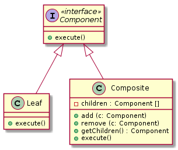
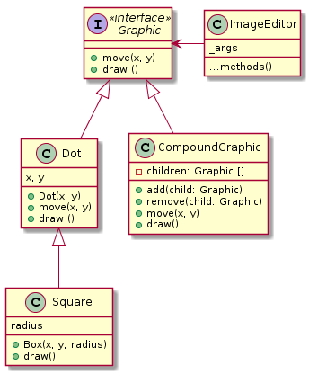

# Composite
###### Znany również jako: Object tree

## :dart: Cel

Pozwala skomponować obiekty w strukturach drzewiastych i pracować z tymi strukturami jakby były one indywidualnymi obiektami.

## :heavy_exclamation_mark: Problem

Zastosowanie wzorca **Composite** ma sens jedynie jeśli podstawowy model aplikacji można zaprezentować w postaci drzewiastej.

Dla przykładu mamy dwa typy obiektów *Products* i *Boxes*. Box może zawierać kilka obiektów typu Product jak również kilka mniejszych obiektów typu *Box*. Te mniejsze obiekty typu Box również mogą zawierać jakieś obiekty typów *Box* lub  *Product*, i tak dalej.

Załóżmy że  zdecydujemy obliczyć wartość tych produktów i pudełek. Aby to zrobić musielibyśmy znać dokładnie strukturę tych pudełek i produktów pisząc program.
 

## :white_check_mark: Rozwiązanie

Wzorzec **Composite** sugeruje że będziemy pracowali z obiektami typów *Product* i *Box* poprzez wspólny interface który zadeklaruje metodę do obliczania całkowitej ceny produktów.

### Abstrakcja i implementacja

*Abstrakcja* (zwana również interface’em) jest warstwą wysokiego poziomu kontroli encji. Ten poziom nie ma za zadanie wykonywać żadnej realnej pracy, powinien przekazywać tą pracę do warstwy implementacji (zwanej platformą).

## :construction: Struktura

1. Interfejs *Component* opisuje operacje wspólne dla prostych i złożonych elementów drzewa.

2. *Leaf* jest podstawowym elementem drzewa, które nie ma podelementów. Zwykle komponenty obiektu typu Leaf kończą większość prawdziwej pracy, ponieważ nie mają nikogo, komu mogliby ją przekazać.

3. *Container* (inaczej *Composite*) jest elementem, który ma podelementy: *Leafs* lub inne pojemniki. *Container* nie zna konkretnych klas swoich dzieci. Działa ze wszystkimi podelementami tylko poprzez interfejs komponentu. Po otrzymaniu żądania kontener przekazuje pracę do swoich podelementów, przetwarza wyniki pośrednie, a następnie zwraca klientowi wynik końcowy.

4. *Client* współpracuje ze wszystkimi elementami za pośrednictwem interfejsu komponentu. W rezultacie klient może pracować w ten sam sposób z prostymi lub złożonymi elementami drzewa.

## :computer: Pseudocode

## :hammer: Możliwość zastosowania

###### *Użyj wzorca złożonego, gdy musisz zaimplementować drzewiastą strukturę obiektu.*
- Wzorzec Composite zapewnia dwa podstawowe typy elementów, które mają wspólny interfejs: proste liście i złożone pojemniki. Pojemnik może składać się zarówno z liści, jak i innych pojemników. Umożliwia to zbudowanie zagnieżdżonej struktury obiektów rekurencyjnych, która przypomina drzewo.

###### *Użyj wzorca, jeśli chcesz, aby kod klienta traktował jednolicie zarówno proste, jak i złożone elementy.*

- Wszystkie elementy zdefiniowane przez wzór złożony mają wspólny interfejs. Korzystając z tego interfejsu, klient nie musi się martwić o konkretną klasę obiektów, z którymi współpracuje.

## :warning: Props / Cons
|Props|Cons|
|-----|----|
|:heavy_check_mark: Możesz pracować ze złożonymi strukturami drzew wygodniej: użyj polimorfizmu i rekurencji na swoją korzyść. |:x: Zapewnienie wspólnego interfejsu dla klas, których funkcjonalność zbyt się różni, może być trudne. W niektórych scenariuszach konieczna jest nadmierna generalizacja interfejsu komponentu, co utrudnia jego zrozumienie.
|:heavy_check_mark: Zasada Open / Close . Możesz wprowadzić nowe typy elementów do aplikacji bez przerywania istniejącego kodu, który teraz działa z drzewem obiektów. |

## :twisted_rightwards_arrows: Relacje z innymi wzorcami

* Podczas tworzenia złożonych drzew kompozytowych można używać wzorcu **Builder**, ponieważ można zaprogramować jego kroki konstrukcyjne do pracy rekurencyjnej.

* Wzorzec **Chain of Responsibility** jest często stosowany w połączeniu ze wzorcem **Composite**. W takim przypadku, gdy komponent Leaf otrzyma żądanie, może przekazać je przez łańcuch wszystkich komponentów nadrzędnych do katalogu głównego drzewa obiektów.

* Za pomocą **Iterators** można przechodzić przez drzewo wzorcu **Composite**.

* Za pomocą narzędzia **Visitor** można wykonać operację na całym  drzewie wzorcu **Composite**.

* Możesz zaimplementować współdzielone węzły *Leaf* drzewa wzorcu **Composite** jako **Flyweights**, aby zaoszczędzić trochę pamięci RAM.

* Wzorzec **Composite** i **Decorator** mają podobne schematy struktur, ponieważ oba polegają na rekurencyjnej kompozycji do organizowania otwartej liczby obiektów.

* Wzorzec **Decorator** jest jak **Composite**, ale ma tylko jeden element potomny. Jest jeszcze jedna znacząca różnica: Decorator dodaje dodatkowe obowiązki do zawiniętego obiektu, podczas gdy Composite po prostu „podsumowuje” wyniki swoich dzieci.

* Wzory mogą jednak również współpracować: można użyć programu **Decorator**, aby przedłużyć zachowanie określonego obiektu w drzewie złożonym.

* Projekty, które często wykorzystują **Composite** i **Decorator**, często mogą skorzystać z **Prototypu**. Zastosowanie wzorca pozwala klonować złożone struktury zamiast ponownie konstruować je od zera.

## :clipboard: Przykład

